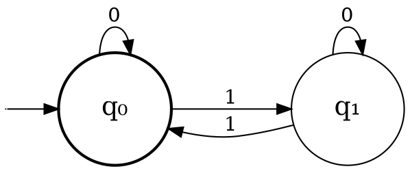
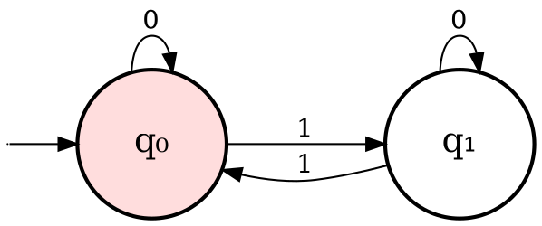
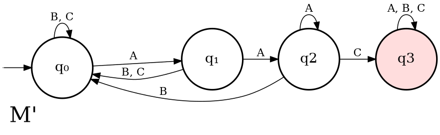
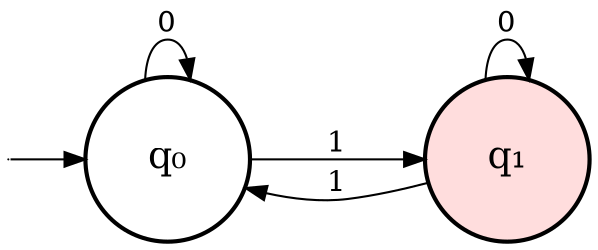

## Topics of Discussion:

### Background
#### Solving linear equations - algorithm

$x_1 + x_2 + x_3 = 7$
$x_1 + x_2 - x_3 = 4$
$2x_2 + x_1 = 3$

- We will learn to solve for each

> Given a system of linear equations, there is an algorithm which can find a situation or state that name exist if the system is infeasible.
> 1700, Gauss

#### Nonlinear equations
Consider the system:
$x^2 + y^2 = 1$
$x^2 + 2y^2 = \frac{1}{2}$
$=> y^2 = -\frac{1}{2}$ , which is infeasible over the reals.

$x^2 + y^2 = 1$
$x^2 + 2y^2 = 2$
$=> x = 0, y = 1$ , which *is* feasible over the reals.

So with nonlinear equations it is either solvable or insolvable.

---
> Is there an analogue of Gaussian elimination for polynomial equations?
> Hilbert

> Showed that there is an analogue of Gaussian elimination for polynomial equations. In partials, given a system of polynomial equations, it will decide whether the system is solvable over $\mathbb{R}$.
> $x^2 - 2 = 0$
> Tarski
---
Is there an analogue of Gaussian elimation to decide feasibility of equations over $\mathbb{Q}$ (rationals).
> Hilbert

> Conjecture: There is no algorithm for this problem.
> Pitfall: No concrete & formal notion of algorithm.
> Tarski

---

### Overall Agenda
- Formally understand the notion of computation + define rigorously what is meant by an algorithm.
- Define rigorously what is meant by an algorithm.
- Show that some problems have no algorithm.
- Machine-independent theory of efficiency of algorithms.

## Alphabets, Strings, and Languages

### Definitions

> [!DEFINITION]
> Alphabet: Finite set of symbols. Use the letter $\Sigma$ to denote the alphabet. 
> 
> Typical examples include:
> - $\Sigma = \{0, 1\}$ 
> 	- (if general "Sigma" is mentioned, just think of it as {0, 1})
> - $\Sigma = \{a, b, c\}$
> - $\Sigma = \{A, B, ..., Z, 0, ..., 9\}$

> [!DEFINITION]
> String: Is a contiguous sequence of symbols from the underlying alphabet of **finite** length.
> 
> If $\Sigma = \{0, 1\}$, examples of strings are 0, 001, 1000, 1001001.

For every $\Sigma$, there is a special string of length 0, called the empty string - this is denoted by $\epsilon$.

> [!NOTE]
> **Question**: Suppose $\Sigma = \{0,1\}$. How many strings are there of length exactly n?
> 
> **Answer**: $2^n$ (two choices for every position).

**Notation**: For $n \geq 0$, we let:
$\Sigma_n :=$ set of strings over $\Sigma$ of length $n$.
$\Sigma_{\leq n} :=$ set of strings over $\Sigma$ of length $\leq n$.
--
$|\Sigma_{\leq n}| = 2^0 + 2^1 + ... + 2^n$
$= 2^n+1 - 1$.
--
$$  
\begin{aligned}  
\Sigma^* &:= \bigcup_{n \geq 0} \Sigma_n \\  
&:= \text{set of all strings over the alphabet } \Sigma \\  
\end{aligned}
$$

> [!DEFINITION]
> Language: A language over the alphabet $\Sigma$ is a subset of $\Sigma^*$.
> 
> Example: If $\Sigma$ = {A, ..., Z} -- English language: set of all words over $\Sigma$ which are "meaningful".

$\Sigma = \{0, 1\}$, example of languages are:
1. $L_1 = \{x \in \{0, 1\}^* : \text{x has an even number of 1s}\}$
2. $L_2 = \{x \in \{0, 1\}^*\ : \text{x ends in 01}\}$
3. $L_3 = \{x \in \{0, 1\}^*\ : \text{x is the binary rep. of a prime}\}$

Examples of what's in each language:
$00 \in L_1$, $\epsilon \in L_1$, $10 \notin L_1$

### Significance
Given a language L, there is a canonical decision problem associated with L - namely given a string x, is x $\in$ L?

> [!DEFINITION]
> Decision Problem: Means that the answer is yes/no (1 or 0).

This class of decision problems can in fact encode any decision problem.

Example: Deciding if a given number x is prime or not is equivalent to deciding if x $\in L_{3(prime)}$ or not?

Given two strings $x,y \in \Sigma^*$, we define xy(or x $\cdot$ y) as the concatenation of x & y (in sequence).
e.g., if x = 101, y = 000,
x $\cdot$ y = 101000, y $\cdot$ x = 000101

> [!DEFINITION]
> Prefix: Given a string x, we say y is a prefix of x if $\exists z {\ } s.t. y \cdot z = x$.
> 
> e.g. if x = 001, y = 00 is a prefix of x.

> [!QUESTION]
> **Question:** If x is of length n, how many prefixes does x have?
> 
> **Answer:** To generate a prefix of x, we have to choose the first i many symbols of x. Since i can range from 0 to n, there are n+1 choices.

> [!DEFINITION]
> Suffix: Given a string x, a suffix y of x is a string s.t. 
> 
> $\exists z \in \Sigma^*$ s.t. zy = x.

If x = 1101, suffixes of x are {1, 01, 101, 1101}.

> [!DEFINITION]
> Substring: Given a string x, a string z is said to be a substring of x if: 
> 
> $\exists y_1, y_2 \exists \Sigma^*$ s.t. $y_1 \cdot y_2$ = x.

>[!QUESTION]
> **Question:** Suppose a string x is of length n. How many substrings does it have?
> 
> **Answer:** # of substrings of length i $\leq$ n-i+1;
> 
> \# of substrings:
> 
> $\sum_{i=0}^{n}$ n-i+1 = O($n^2$).

## Finite State Machine
### Introduction

> [!DEFINITION]
> Deterministic finite automate (FSM / DFA): A  DFA consists of a finite set of states with rules for transitions between them.
> - Computation begins at a designated state called the "start state / initial state".
> - Given a string x, the DFA starts at the start state & updates its state as it reads the symbols from left to right.

x = 1 0 1 0 1
$$
q_0 
\xrightarrow{1} q_1 \xrightarrow{0} q_1 \xrightarrow{1} q_0 \xrightarrow{0} q_0 \xrightarrow{1} q_1
$$

- For any state & any symbol, the next state is uniquely defined. Meaning there is only 1 possible next state.
- Finally, in a DFA, a subset of states are designated as "final / accepting" states. If at the end of computation, the state is a final state, then the given string is "accepted". Else, it is "rejected".

x = 1 0 1 0 1
$$
q_0 
\xrightarrow{1} q_1 \xrightarrow{0} q_1
\xrightarrow{1} q_0 \xrightarrow{0} q_0 \xrightarrow{1} q_1
$$

Thus x is rejected.

y = 1 0 1 0
$$
q_0 \xrightarrow{1} 
q_1 \xrightarrow{0} 
q_0 \xrightarrow{1} 
q_1 \xrightarrow{0} q_0 
$$

> [!NOTE]
> An automaton can have 0, 1 or more accepting states.

> [!QUESTION]
> **Question**: With this automaton, what is the set of strings that is accepted in natural language?
> **Answer**: The set of strings accepted by M is precisely the set of strings with an even # of 1s.

> [!DEFINITION]
> An Automaton $M$'s language: Given an automaton $M$, its language, denoted by $L(M)$ is the set of strings which $M$ accepts.

$$
L(M) = \left\{ x \in \left\{ 0, 1 \right\} ^{*} : \text{x has an even \# of 1's} \right\} 
$$

So, $L(M) = L_{1}$

---

### More Finite Automata

*Broad desideratum (what we desire): Given a language, designing a DFA $M$ s.t. $L=L(M)$*

$$
L_{2} = \left\{ x \in \left\{ A, B, C \right\} ^{*} : \text{x has the substring AAC} \right\}.
$$

$L(M') = L_{2}$

---
> [!INFO]
> **DFA construction principle**:
> 1. Keep track of finite amount of info for the strings (reflected in the states).
> 2. Information is updated as we see the symbols.

#### DFA Formal Definition:
> [!DEFINITION]
> DFA Formal Definition:
> 
> $M = \left( \mathbb{Q}, \Sigma , \delta,  q_{0}, \mathbb{F} \right)$
> 
> $\mathbb{Q}$ - set of states
> 
> $\Sigma$ - alphabet
> 
> $\delta$ - transition function
> 
> $q_{0}\in Q$ - start state.
> 
> $\mathbb{F}\leq Q$ - set of final states

$$
\delta: \mathbb{Q} \times \Sigma \to \mathbb{Q} \text{ for M}
$$

$Q = \left\{ q_{0}, q_{1}, q_{2}, q_{3} \right\}$
$\Sigma = \left\{ A, B, C \right\}$
$q_{0} \to \text{start state}$ 
$\mathbb{F} = \left\{ q_{3} \right\}$

$$
\begin{aligned}
&\delta(q_{0}, A) = q_{1}, \delta(q_{0}, B) = \delta(q_{0}, C) = q_{0} 
\\
&\delta(q_{1}, A) = q_{2}, \delta(q_{1}, B) = \delta(q_{1}, C) = q_{0}
\\
&\delta(q_{2}, A) = q_{2}, \delta(q_{1}, B) = q_{0}, \delta(q_{2}, C) = q_{3}
\\
&\delta(q_{3}, A) = \delta(q_{3}, B) = \delta(q_{3}, C) = q_{3}
\end{aligned}
$$

> [!DEFINITION]
> Multi-step Transition Function: Given a DFA $M = \left( \mathbb{Q}, \Sigma , \delta,  q_{0}, \mathbb{F} \right)$, we define $\hat{\delta}$, the multi-step transition function as follow:
> 
> $\hat{\delta} : \mathbb{Q} \times \Sigma^{*} \to \mathbb{Q}$
> 
> $\hat{\delta}(q, x)$ is intended to be the state reached starting at q and reading the string x.

**Inductive Definition**:
- If $\left| x \right| = 0 \text{ (i.e., }x = \Sigma)$, $\hat{\delta}(q, x) = q$
- If $\left| x \right| > 0$, let x = $y\sigma$, where $y \in \Sigma^{*}, \sigma \in \Sigma$.
	- Essentially, y is everything right before the last element, $\sigma$.
$$
\hat{\delta}(q, x) := \delta(\hat{\delta}(q, y), \sigma)
$$

Given $M = \left(\mathbb{Q},\Sigma,\delta,q_{0},\mathbb{F} \right)$,
$L(M) = \left\{ x \in\Sigma^{*}: \hat{\delta} (q_{0}, x) \in \mathbb{F} \right\}$

> [!DEFINITION]
> Regular languages: A language L is said to be regular if $\exists$ DFA M s.t. L(M) = L.

### Examples to formally argue the correctness of automata

Lemma: $L(M_{1}) = \left\{\left\{0,1\right\}^{*}: \text{x has an even \# of 1s}\right\}$. 

#### Proof DFA by Induction 1:

Proof: To prove this, it suffices to prove that:

Claim: For any string x, $\delta (q_{0},x) = q_{0} \iff \text{x has an even \# of 1s}$

Proof: By induction on length of x.
Base case: $\left| x \right| = 0, i.e. x = \varepsilon$.
- $\hat{\delta}(q_{0}, x) = q_{0}$. On the other hand $\varepsilon$ has an even # of 1s.
- Base case is proven.

Induction case: $\left|x\right|\geq0.$ Let $x=y\sigma$
$\sigma=0 \| 1$, $\hat{\delta}(q_{0}, y) = q_{0}\|q_{1}$

Case 1: $\hat{\delta}(q_{0},y)=q_{0}$, $\sigma=0$
In this case, by IH, y has an even # of 1s. So, $y\sigma = x$ has an even # of 1s. 

Converse:
$$
\begin{align}
\hat{\delta}(q_{0}, x) \\
= \delta(\hat{\delta}(q_{0},y),0) \\
= \delta(q_{0},0) = q_{0}
\end{align}
$$

Case 2: $\hat{\delta}(q_{0},y)=q_{0},\sigma = 1$
Again by IH, y has an even # of 1s.
$y\sigma = x$ has an odd # of 1s.

Converse:
$$
\begin{align}
\hat{\delta}(q_{0}, x) = \delta(\hat{\delta},y),1) \\ \\
= \delta(q_{0}, 1) = q_{1}
\end{align}
$$

Case 3, Case 4 as exercise.

---

$L(M') = \left\{ x \in \left\{ A,B,C \right\}^{*} : \text{x has the substring AAC}\right\}$

Claim: $\hat{\delta} (q_{0},x)=q_{3}$ iff x has the substring AAC.

#### Proof DFA by Induction 2:

Let's try to prove this claim by induction.

Base case: $\left| x \right| = 0$
Cases: $\hat{\delta}(q_{0}, y) = q_{0}$, so x does not have substring AAC & $\hat{\delta}(q_{0}, y) \neq q_{3}$

Induction case: $\left| x \right| > 0$.
Let x = $y\sigma$.
$\hat{\delta}(q_{0}, y)$ = $q_{3}\|\left\{ q_{0}, q_{1}, q_{2} \right\}$
$\sigma = \left\{ A, B, C \right\}$

Case: $\hat{\delta}(q_{0}, y) \in \left\{ q_{0}, q_{1}, q_{2} \right\}, \sigma = C$
$\hat{\delta}(q_{o}, x) = \delta(\hat{\delta}(q_{0}, y), C)$.

This is hard to prove via induction, because depending on whether $\delta(q_{0},y) \text{ is } q_{0}\| q_{1}\|q_{2}$, 
$\hat{\delta}(q_{0},x)$ will vary.

New Claim: $\hat{\delta}(q_{0},x)$ =

1. $q_{3}$ if x has the substring AAC.
2. $q_{2}$ if x doesn't have the substring AAC but the last 2 symbols are AA.
3. $q_{1}$ if x doesn't have the substring AAC & the last symbol is A but last two are not AA.
4. $q_{0}$ if x does not have the AAC as substring, the last symbol is B or C, or x = $\varepsilon$

Proof is essentially by induction on length of x.

Base case: $\left| x \right| = 0$.

$\hat{\delta}(q_{0},x) = q_{0}$: Indeed x = $\varepsilon$, thus, we're in case 4.

Induction case: $\hat{\delta}(q_{0},y) = q_{0}, q_{1}, q_{2}, q_{3}$
x = $y\sigma$, $\sigma = A,B,C$

Case: $\hat{\delta}(q_{0}, y) = q_{0}$, $\sigma = A$.

In this case, 

$$
\begin{align}
\hat{\delta}(q_{0}, x) \\ \\
= \delta(\hat{\delta}(q_{0},y), \sigma) \\ \\
= \sigma(q_{0, \sigma}) = q_{1}
\end{align}
$$

If y doesn't have AAC as substring, x = $y\sigma$ also doesn't have AAC as a substring. So we're in case 3.

Case: $\hat{\delta}(q_{0},y) = q_{2}$, $\sigma = C$.
By IH, y doesn't have the substring AAC but ends in AA.
Then x = $y\sigma$ ends in AAC.

$\hat{\delta}(q_{0}, x) = \delta(\hat{\delta}(q_{0}, y), C)$
$= \delta(q_{2}, C) = q_{3}$.
Case is verified.

Similarly, verify the other 10 cases.

### Tips to do induction-based proof of correctness

For each state q:
1. Obtain a precise description of the strings x s.t. $\hat{\delta}(q_{0}, x) = q$
2. For each symbol $\sigma \in \varepsilon$, $q \in \mathbb{Q}$, under the assumption that $\hat{\delta}(q_{0}, y) = q$, show that $\hat{\delta}(q_{0}, x) = \delta(q,\sigma)$.
In other words, have a case corresponding to each state & each symbol & verify that your claim is correct using IH.

> [!NOTE]
> If you wanted to implement a DFA M in C (or any other programming language), you will need one variable (keeps track of what state you are in, so values between 1 and Q) & a set of $\left| \mathbb{Q} \right|\left| \varepsilon \right|$ many if-then states.
> - Memory requirement: log$\left| \mathbb{Q} \right|$ bits (since Q is a constant, and we are dealing with bits, we know it's $\log\left| \mathbb{Q} \right|$ and is a constant).
> - In C prog. model, finite automata can be implemented as constant memory, one pass algorithm, and linear running time!

