## Motivation: What DFAs Can and Can’t Do

Goal: Understand limitations of DFAs.

$L_{count} = \left\{ x \in \left\{ 0,1 \right\}^{*} : \text{x has the same number of 0s and 1s}\right\}$

To construct a DFA for $L_{count}$, it seems like a finite # of states have to be able to keep track of 0s and 1s you've encountered.

Heuristically, it seems like $L_{count}$ may not have a DFA.

$L_{left,2} = \left\{ x \in\left\{ 0,1 \right\}^{*}:\text{2nd bit from the left is a 1} \right\}$

## Constructing DFA for $L_{left,2}$
### DFA for $L_{left,2}$

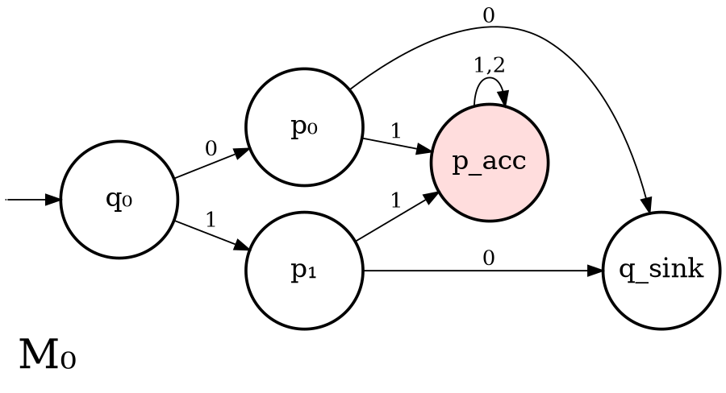
	$L(M_{0}) = L_{left,2}$

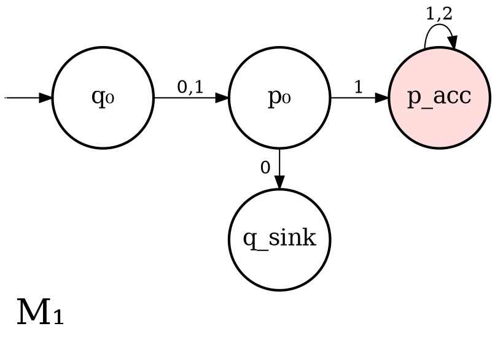
	$L(M_{1}) = L_{left,2}$

> [!QUESTION]
> Is there a 3-state DFA M s.t. $L(M) = L_{left,2}$?
> 
> No.

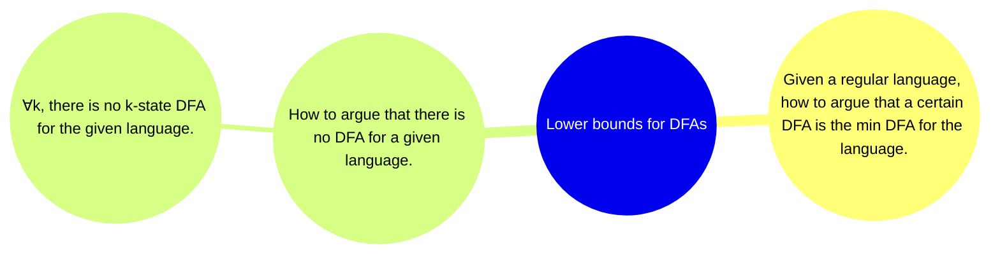

#### Definition of Distinguishability
> [!DEFINITION]
> Distinguishability: For a given language L, we say x,y are distinguishable w.r.t L if $\exists z \in \Sigma^{*}$ s.t. exactly one of xz or yz is in L.

$L_{left,2} = \left\{ x \in \left\{ 0,1 \right\}^{*}: \text{2nd bit from the from the left is 1.} \right\}$

1. x = 01 and y = 0 $[z=\varepsilon\text{, they are distinguishable}]$
2. x = 1 and y = 0 $[\text{they're indistinguishable}]$

$L_{count} = \left\{ x \in \left\{ 0,1 \right\}^{*}: \text{x has the same number of 0s and 1s} \right\}$

1. x = 01 and y = 0 ($z=\varepsilon$, they're distinguishable)
2. x = 110 and y = 01011 (they're indistinguishable, no matter what z is, both will have the same state, either in or out of L.)
	- Because xz $\in L_{count} \iff$ # of 0s in z - # of 1s in z = 1.
	- AND yz $\in L_{count} \iff$ # of 0s in z - # of 1s in z = 1.

## Introducing Claim 1
Claim 1: Suppose for a language L, we have k strings $x^{(1)}, \dots, x^{(k)}$ s.t. for any i $\neq$ j, $x^{(i)}$ and $x^{(j)}$ are distinguishable w.r.t. L.
Then, any DFA for L must have at least k states.

$L_{left,2} = \left\{ x \in \left\{ 0,1 \right\}^{*}:\text{2nd bit of x from the left is 1} \right\}$.

We constructed a 4-state DFA for $L_{left,2}$. To show optimality of this construction, we'll exhibit 4 pairwise distinguishable strings w.r.t. $L_{left,2}$.

$$
\begin{align}
A := \left\{ \varepsilon, 0, 00, 01 \right\} \\
\end{align}
$$
First of all, if x = $\varepsilon\| 0\|00$ it is distinguishable from y = 01. ($y \in L_{left,2}$ and $x \not\in L_{left,2}$)
$$
\begin{align}
x = \varepsilon, y = 0 \text{ (consider z = 1)} \\
x = \varepsilon, y = 00 \text{ (consider z = 11)} \\
x = 0, y = 00 \text{ (consider z = 1)} \\
\end{align}
$$

Then, any DFA for $L_{left,2}$ must have at least $\left| A \right| = 4$ many states.

We concluded that $L_{left,2}$ has a 4-state DFA & it is optimal.

---
### Claim 1 Example: DFA for $L_{left,k}$
$L_{left,k}=\left\{ x \in \left\{ 0,1 \right\}^{*}: \text{the kth bit from the left is 1} \right\}$

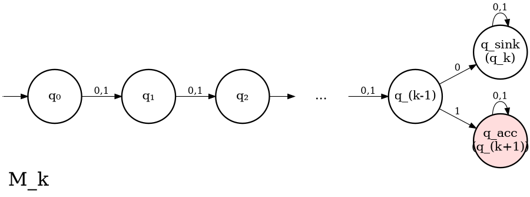

$M_{k}$ is s.t. $L(M_{k}) = L_{left,k}$. # of states is k + 2.

Claim 2: No DFA for $L_{left,k}$ has < k+2 states.

Recall for k=2, i.e. $L_{left,2}$ our distinguishing set was A = $\left\{ \varepsilon, 0, 00, 01 \right\}$.

$A_{k} := \left\{ \varepsilon, 0, 00, \dots, 0^{k}, 0^{k-1}1 \right\}$
(Note: $0^{k}$ means the string 0 repeated k times).

If we succeed in showing that for $x \neq \in A_{k}$, x & y are distinguishable w.r.t. $L_{left,k}$, then it will imply that any DFA for $L_{left,k}$ must have at least K+2 states.

Goal: Prove that for x,y x $\neq$ y in $A_{k}$, x&y are distinguishable w.r.t. $L_{left,k}$

Proof: $0^{k-1}1 \in L_{left,k}$ and $0^{j} \not\in L_{left,k}$ for any $0 \leq j \leq k$. Thus, $0^{k-1}1$ & $0^{j}$ (for $0 \leq j \leq k$) are distinguishable w.r.t $L_{left,k}$.

The other possibility is that our pair is $0^{i}$ and $0^{j}$ for some $0 \leq i \neq j \leq k$.

w.l.o.g., assume $i < j$ (either i is smaller, or j is smaller, so doesn't matter.

$x = 0^{i}$, $y=0^{j}$. Consider $z = 0^{k-i-1}1$. Observe this is well-defined because $i < j \leq k \implies i \leq k - 1$. Thus, k - i - 1 $\geq 0$.

$$
\begin{align}
xz &= 0^{i}0^{k-i-1}1 = 0^{k-1}1 \in L_{left,k} \\
yz &= 0^{j}0^{k-i-1}1 = 0^{k-1+(j-i)}1 \\
&= 0^{m}1 \text{ (where m } \geq k).
\end{align}
$$

For yz, the first k is all 0's, so $yz \not\in L_{left,k}$.

Thus, $x=0^{i}$, $y=0^{j}$ are distinguishable w.r.t. $L_{left,k}$.

Thus, any DFA for $L_{left,k}$ has k+2 states. 

So, now we want to prove Claim 1.

## Proving Claim 1 - DFA Lower Bounds - via Distinguishability

Claim 1: Suppose for a language L, we have k strings $x^{(1)}, \dots, x^{(k)}$ s.t. for any i $\neq$ j, $x^{(i)}$ and $x^{(j)}$ are distinguishable w.r.t. L.

Then, any DFA for L must have at least k states.

Proof: Let M be a DFA for L with $\mathbb{T}$ states. Let $q_{0}$ be the start state of M & $\delta$ be its transition fn.

Let $p^{i} := \delta^{*}(q_{0}, x^{i})$ for i = 1, ..., k.

Observe that since $x^{i}$ and $x^{j}$ are distinguishable w.r.t. L, then $p^{i}$ and $p^{j}$ must be distinct states (they cannot be the same states).

This is because $\delta^{*}(q_{0}, x^{i}z)$ = $\delta^{*}(p^{i}, z)$ & $\delta^{*}(q_{0}, x^{j}z)$ = $\delta^{*}(p^{j}, z)$

If $p^{i}$ and $p^{j}$ were identical. Then $\forall z$, $\delta^{*}(q_{0}, x^{i}z)$ = $\delta^{*}(q_{0}, x^{j}z)$.

=> $\forall z$ either both $x^{i}z, x^{j}z, \in L$ or neither is $\Rightarrow\!\Leftarrow$ (contradiction).
=> $\forall i \neq j$, states $p^{i}$ & $p^{j}$ are distinct. Thus $\mathbb{T} \geq k$.

### Applications: When Languages Are Not Regular
Corollary: For a language L, if $\exists$ an infinite set S s.t. $\forall x \neq y \in S$, x and y are distinguishable w.r.t. L, then L is not regular.

---
## $L_{right,k}$: Right-to-Left Bit Constraints and Exponential Lower Bounds
$L_{right,2} = \left\{ x \in \left\{ 0,1 \right\}^{*}: \text{2nd bit from the right is a 1} \right\}$.

Idea: To construct a DFA for $L_{right,2}$, you have to keep track of the last 2 bits you've encountered.

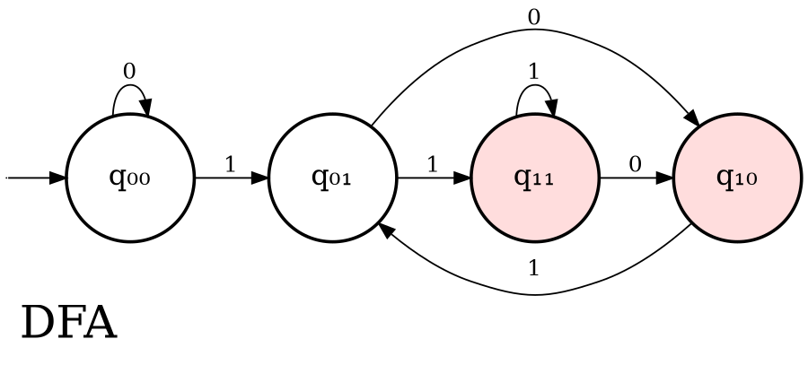

Lemma: Any DFA for $L_{right,2}$ must have at least 4 states.

Proof: $A := \left\{ 00, 01, 10, 11 \right\}$. Claim is that any x,y s.t. $x \neq y \in A$, x & y are distinguishable.

| x   | y   | z   | xz  | yz  | ✓ |
|-----|-----|-----|-----|-----|---|
| 00  | 01  | 0   | 000 | 010 | ✓ |
| 00  | 10  | ε   | 00  | 10  | ✓ |
| 00  | 11  | ε   | 00  | 11  | ✓ |
| 01  | 10  | ε   | 01  | 10  | ✓ |
| 01  | 11  | ε   | 01  | 11  | ✓ |
| 10  | 11  | 1   | 101 | 111 | ✓ |

This proves any DFA for $L_{right,2}$ must have at least 4 states.

Define $L_{right,k} := \left\{ x \in \left\{ 0,1 \right\}^{*}: \text{the kth bit from the right is a 1} \right\}$.

> [!TIP]
> Suggested exercise: Try to construct a $2^{k}$ state DFA for $L_{right,k}$

Lemma: Any DFA for $L_{right,k}$ must have at least $2^{k}$ states.

Proof: Define $A_{k} := \left\{ 0,1 \right\}^{k}:\text{all strings of length k over } \left\{0, 1\right\}$

Our claim is that for $x,y \in A_{k}$ s.t. $x \neq y$, x & y are distinguishable w.r.t. $L_{right,k}$.

Let $x \neq y \in A_{k}$. Let $x = x_{1} \dots x_{k}$ and $y=y_{1}\dots y_{k}$. Since x & y are different. $\exists j$ s.t. $x_{j} \neq y_{j}$.

W.l.o.g assume $x_{j} = 1$ and $y_{j} = 0$.
Consider $z=0^{j-1}$. Then,

$xz = x_{1}\dots x_{k}\underbrace{ 0\dots 0 }_{ \text{j-1 zeros} }$
- observe that the kth bit from the right in xz is just $x_{j}$
	- if j=1, kth bit from right is $x_{1}$
	- if j=2, kth bit from right is $x_{2}$
	- so on...

Likewise, in yz = $y_{1} \dots y_{k} \underbrace{ 0 \dots 0 }_{ \text{j-1 zeros} }$, the kth bit from the right is $y_{j}$.
$xz \in L_{right,k}$ and $yz \not\in L_{right,k}$
=> x & y are distinguishable w.r.t. $L_{right,k}$.
Thus, any DFA for $L_{right,k}$ must have at least $\left| A_{k} \right| = 2^{k}$ states.

---

## Non-Deterministic Finite Automata (NFA)

- Define NFAs
- Show how to construct NFAs
- Show that NFAs & DFAs are equivalent in expressive power.

Is this a DFA?
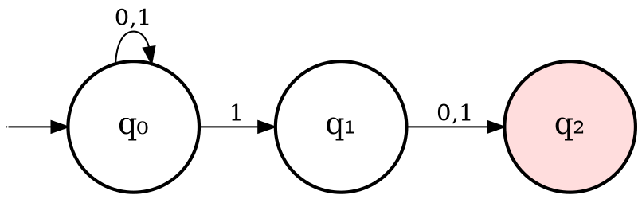

- There are 2 transitions labeled with 1 out of $q_{0}$
- there are no transitions out of $q_{2}$.
This is not a DFA but a NFA.

> [!DEFINITION]
> NFAs: exactly like DFAs with one key difference. In the transition fn., for a given state & symbol, we're allowed to have 0,1, or more next states.

#### Examples

x = 0 1 1 0

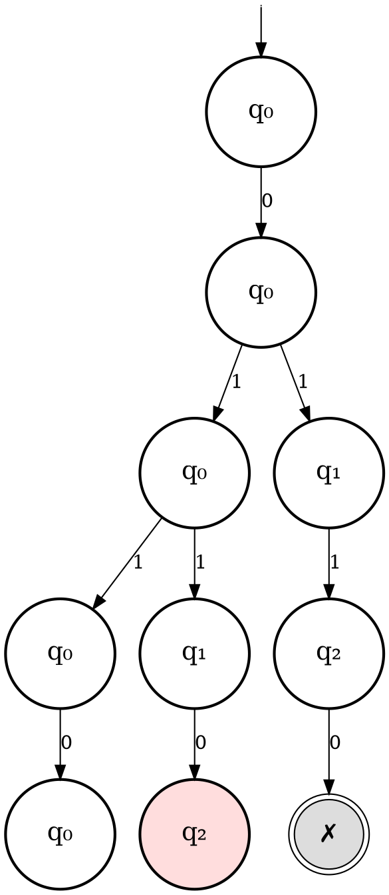

Thus x = 0 1 1 0 is accepted.
The NFA accepted an input x if at the end of computation, $\exists$ at least one surviving thread which is in a final state. 

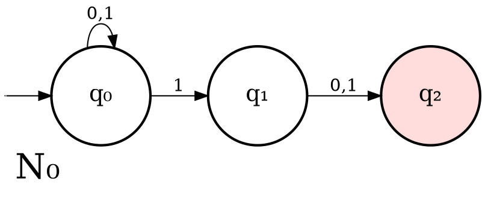

x = 0 0 1 0 0

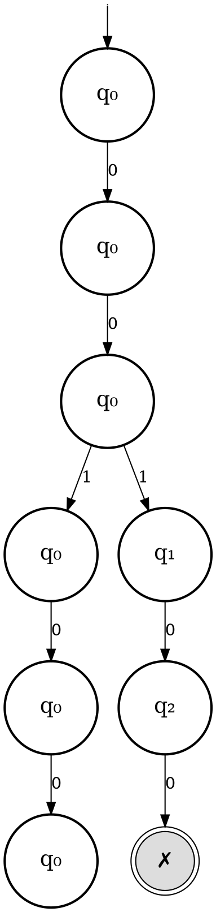
Thus, x = 0 0 1 0 0 is rejected.

- If the next state is unique, the state of thread updates to the next state.
- If there is no next state for the given symbol, thread perishes.
- If there is more than one next state, then the thread splits & there is a new thread for each of the possible next states.
- An input x is accepted iff $\exists$ a surviving thread in an accepting state.

---

For a NFA N, its language L(N) is given by the set of the strings which N accepts.

Observation: $L(N_{0})= \left\{ x \in \left\{ 0,1 \right\}^{*}: \text{2nd bit from the right is 1} \right\}$.

Claim: $L(N_{0})= \left\{ x \in \left\{ 0,1 \right\}^{*}: \text{2nd bit from the right is 1} \right\}$
$:= L_{right,2}$

Proof: First, we argue that any string $x \in L_{right,2}$ is accepted by $N_{0}$.

If $x \in L_{right,2}$, then x = z1b where $z \in \left\{ 0,1 \right\}^{*}$, $b \in \left\{ 0,1 \right\}$.

Consider the execution path of $N_{0}$ on x which is as follows: Suppose $\left| z \right| = \mathbb{T}$

$$
q_0 \xrightarrow{z_1} q_0 \xrightarrow{z_2} q_0 \xrightarrow{\cdots z_T} q_0 \xrightarrow{1} q_1 \xrightarrow{b} q_2
$$

This is an accepting execution.

Thus, $x \in L_{right,2}$ is accepted by $N_{0}$.

Consider the other direction: Suppose x is accepted by $N_{0}$. There must be a path of executive which ends up in $q_{2}$.

$$
q_0 \xrightarrow{x_1} p^{(1)} \xrightarrow{x_2} p^{(2)} \xrightarrow{\cdots} \cdots \xrightarrow{x_n} p^{(T)}
$$

If this is an accepted path, then $p^{T}=q_{2}$. So $p^{T-1}=q_{1}$. And $p^{T-2}= q_{0}$ (There is only one way to enter $q_{1} \& q_{2}$).

$\delta(p^{T-2}, x_{n-1})= p^{T-1}$

But $p^{T-2} = q_{0}$ & $p^{T-1} = q_{1}$. The only possibility for $x_{n-1} = 1$ => 2nd bit from the right in x is 1.

$L_{right, k} = \left\{ x \in \left\{ 0,1 \right\}^{*}: \text{the kth bit from the right is 1} \right\}$.

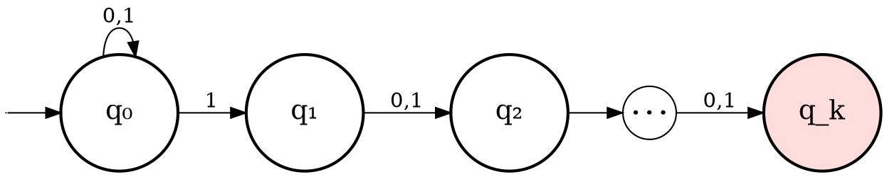

$L(N_{k}) = L_{right,k}$

> [!TIP]
> Complete the above proof by yourself!

Lemma: $L(N_{k}) = L_{right,k}$
Proof: Suppose $x \in L_{right,k}$. Then $x = z_{1}b, \dots b_{k-1}$ where $z \in \left\{ 0,1 \right\}^{*}$ $b_{1}\dots,b_{k-1}\in \left\{ 0,1 \right\}$.

Consider the path:

$$
q_0 \xrightarrow{z_1} q_0 \xrightarrow{\cdots} q_0 \xrightarrow{z_T} q_0 \xrightarrow{1} q_1 \xrightarrow{b_1} q_2 \xrightarrow{\cdots} q_{k-1} \xrightarrow{b_{k-1}} q_{k} 
$$

This is an accepting path of execution. Thus x is accepted by $N_{k}$.

In the other direction, suppose x is accepted by $N_{k}$. Then $\exists$ an accepted path.

$$
q_0 \xrightarrow{x_1} p^{(1)} \xrightarrow{x_2} p^{(2)} \xrightarrow{\cdots} \cdots \xrightarrow{x_n} p^{(n)}
$$

Since this is an accepted path $p^{n} = q_{k}$.
But then $p^{n-1} = q_{k-1}$, $p^{n-2} = q_{k-2}, \dots p^{n-k} = q_{0}$. Thus $\delta(p^{(n-k)},\, x_{n - (k+1)}) = p^{(n - k + 1)}$
i.e. $\delta(q_{0}, x_{n-(k-1)})= q_{1}$
=> $x_{n-(k-1)}= 1$.

Thus, kth bit from the right in x is 1.

The NFA $N_{k}$ is s.t. $L(N_{k}) = L_{right,k}$. $N_{k}$ has k+1 states. A DFA for $L_{right,k}$ has at least $2^{k}$ states.

---
### Revisiting $L_{AAC}$ example

$L_{AAC}=\left\{ x \in \left\{ A, B, C \right\}^{*}: \text{x has the substring AAC} \right\}$

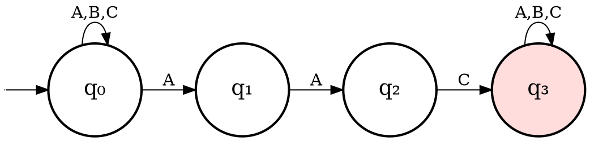

Observe that $L(N_{AAC}) = L_{AAC}$.

Observe that for any k-bit pattern z, there is a NFA with k+1 states, call it $N_{z}$ s.t. $L(N_{z})= \left\{ x \in \varepsilon^{*}: \text{x comtains z as a substring} \right\}$.

Claim: $L(N_{AAC})=L_{AAC}$

Proof: Suppose $x \in L_{AAC} \implies x = zAACy$ where $z,y \in \left\{ A,B,C \right\}^{*}$. Let $\left| z \right| = \mathbb{T}, \left| y \right| = \mathbb{T}'$

Consider the path:

$$
q_0 \xrightarrow{z_1} q_0 \xrightarrow{z_2} \cdots \xrightarrow{z_T} q_0 \xrightarrow{A} q_1 \xrightarrow{A} q_2 \xrightarrow{C} q_3 \xrightarrow{y_1} q_3 \xrightarrow{y_2} \cdots \xrightarrow{y_T} q_3
$$

Thus, this is an accepting path.

In the converse direction, suppose x is accepted. This implies that there is an accepting path.

$$
q_0 \xrightarrow{x_1} p^{(1)} \xrightarrow{x_2} p^{(2)} \xrightarrow{\cdots} \cdots \xrightarrow{x_n} p^{(n)}
$$
Thus $p^{n} = q_{3}$. 

Since $q_{3}$ is a sink state, consider the least T s.t.

$$
\begin{align}
p^{(T)} = q_3, \quad p^{(T-1)} &= q_2, \quad p^{(T-2)} = q_1, \quad p^{(T-3)} = q_0 \\
\delta(p^{(T-1)},\, x_T) &= p^{(T)} \Rightarrow \delta(q_2, x_T) = q_3 \\
\delta(p^{(T-2)},\, x_{T-1}) &= p^{(T-1)} \Rightarrow \delta(q_1, x_{T-1}) = q_2 \\
\delta(p^{(T-3)},\, x_{T-2}) &= p^{(T-2)} \Rightarrow \delta(q_0, x_{T-2}) = q_1
\end{align}
$$

=> $x_{T} = C, x_{T-1} = A, x_{T-2}= A$
- AAC appears as a substring in x.

---

### Formal Definition of NFAs

> [!DEFINITION]
> NFA Formal Definition: $N = (Q, \Sigma, \Delta, q_{0}, F)$
> - Everything is same as before, $q_{0} \in Q, F \subseteq Q$
> - $\Delta : Q \times \Sigma \to 2^{Q}$
> 	- Elements of $2^{Q}$ are subsets of $\mathbb{Q}$.

- Contrast this with DFA where transition function maps $Q \times \Sigma \to Q$.

So, for $N_{AAC}$, state space $Q=\left\{ q_{0}, q_{1}, q_{2}, q_{3} \right\}$.
Initial state is $q_{0}$, $F=\left\{ q_{3} \right\}$.
$\Sigma = \left\{ A,B,C \right\}$.

$$
\begin{align}
\Delta(q_0, A) &= \{q_0, q_1\}, \quad \Delta(q_0, B) = \Delta(q_0, C) = \{q_0\} \\
\Delta(q_1, A) &= \{q_2\}, \quad \Delta(q_1, B) = \Delta(q_1, C) = \emptyset \\
\Delta(q_2, C) &= \{q_3\}, \quad \Delta(q_2, A) = \Delta(q_2, B) = \emptyset \\
\Delta(q_3, A) &= \Delta(q_3, B) = \Delta(q_3, C) = \{q_3\}
\end{align}
$$
---
Basically...
A string $x$ is accepted by a  
NFA $N = (Q, \Sigma, \Delta, q_0, F)$ iff $\exists$  
a sequence of states $p^{(0)}, p^{(1)}, \dots, p^{(n)}$ , where $n = |x|$, s.t.

① $p^{(0)} = q_0$ ;

② $p^{(n)} \in F$ ;

③ For $0 \leq i < n$, $p^{(i+1)} \in \underbrace{ \Delta(p^{(i)}, x_i) }_{\text{set of states}}$.

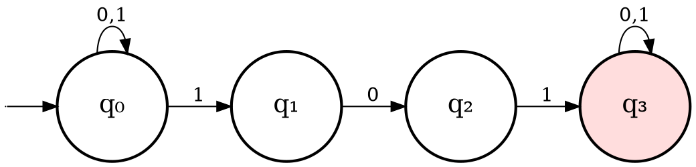

$N_{101}$, then $L(N_{101}) =$

${ x \in {0,1}^* : \text{has 101 as a substring} }$

$x = 1010100$

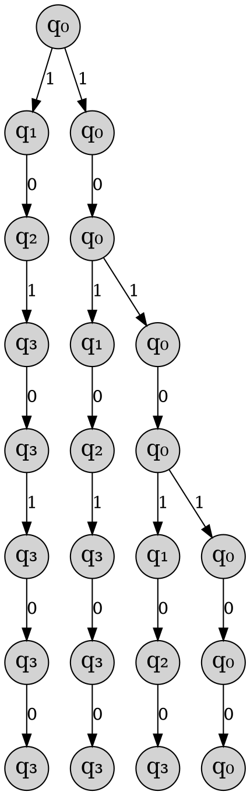
- Emphasis on Layer 5! There's no point in having two different threads in the same state.

Observation: At any time T, when we're simulating the NFA, if we have multiple threads in a state q, we can drop all but one of them.

### How NFA Simulation works

- To simulate a NFA, at any stage, we only need to keep track of the subset of states that the threads are in.
- If we know the subset of states at time T & the symbol read, we will also know the subset of states at time T+1.

> [!TIP]
> Prove this lemma by yourself:
> Lemma: For any NFA N with Q states, there is a DFA M with at most $2^{Q}$ states s.t. L(M) = L(N).